#  OpenClassrooms - iOS development path - iOS Project 5
## Gridy - Adaptive layout (iPhones and iPads)
## UIGraphics - Drawing - UserDefaults

This is a photo puzzle game. 
The user will start off with picking a photo using either a camera captured photo, a photo from library or let the app randomly pick a stored photo.
The user can then adjust the photo position by moving, rotating and/or zooming within the 16 squares grid. 
The user can share the completed puzzle picture at the end via email, social media etc... 
The application counts the number of moves used to solve the puzzle. 
The application has a scoring streaks system for continuous correct moves, and for incorrect moves the app reset the scoring streak and removes a point from the score unless score is at 0 points. 
There is a peak "hint" feature to help the user solve the puzzle, whereby the puzzle photo appears on the screen for two seconds.

## Portrait
Launch screen.

Selecting or capturing a photo.

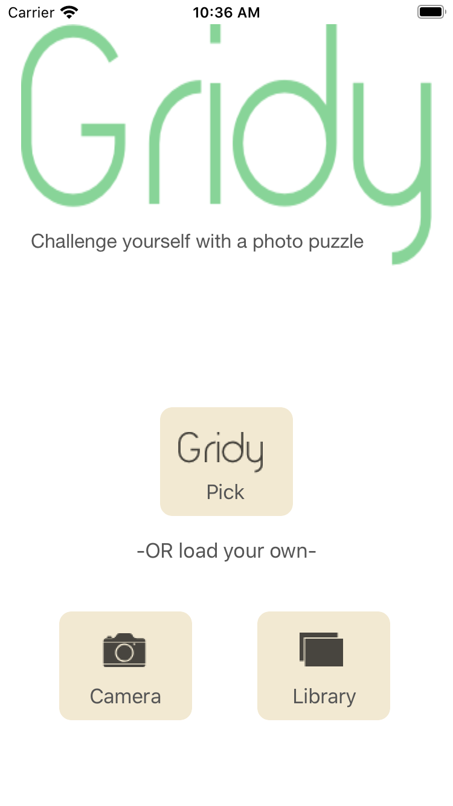

Adjusting the photo.

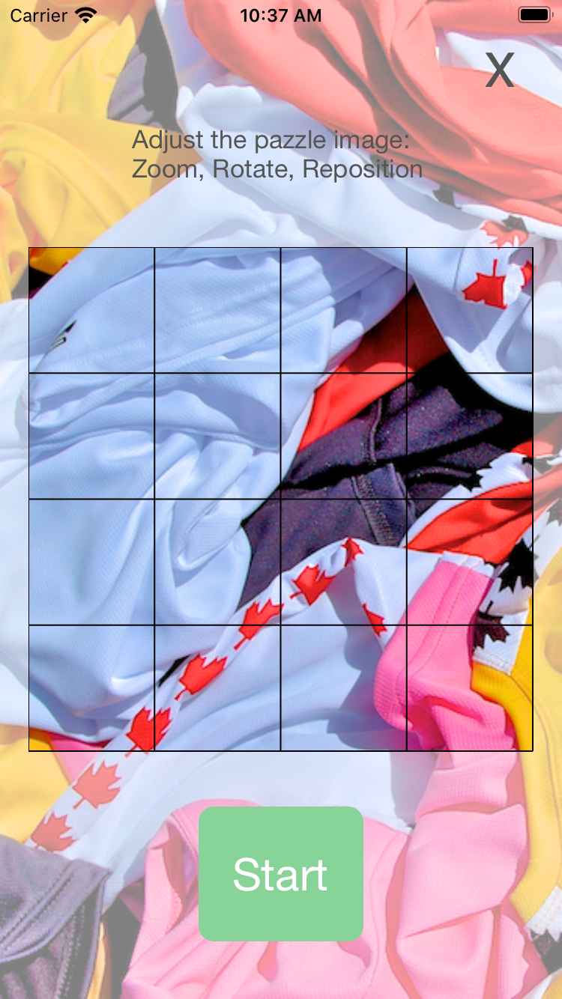

Solving the puzzle (the fewer the moves, the higher the score). 
Peek "hint" feature

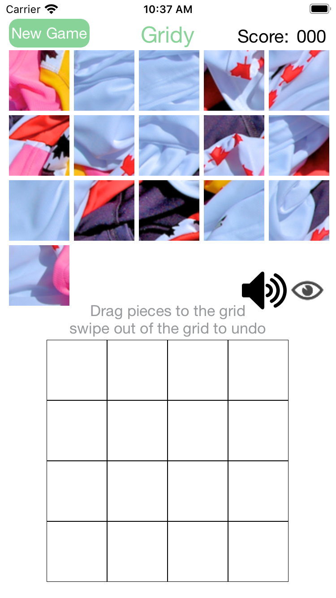
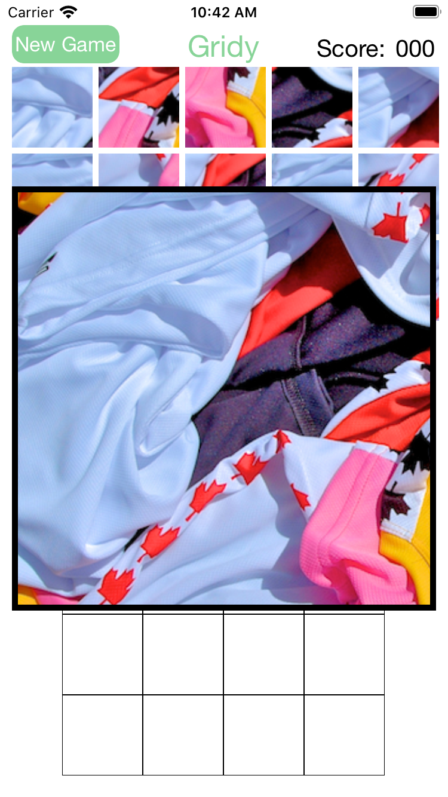
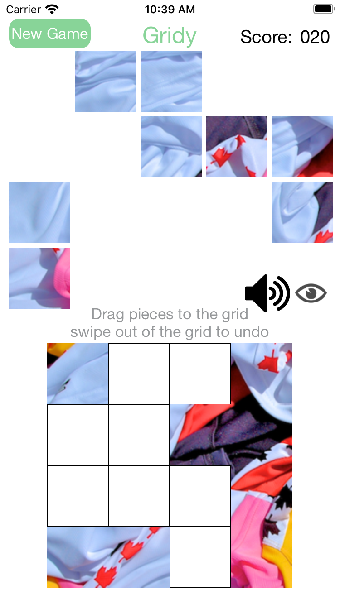

Sharing the solved puzzle with friends

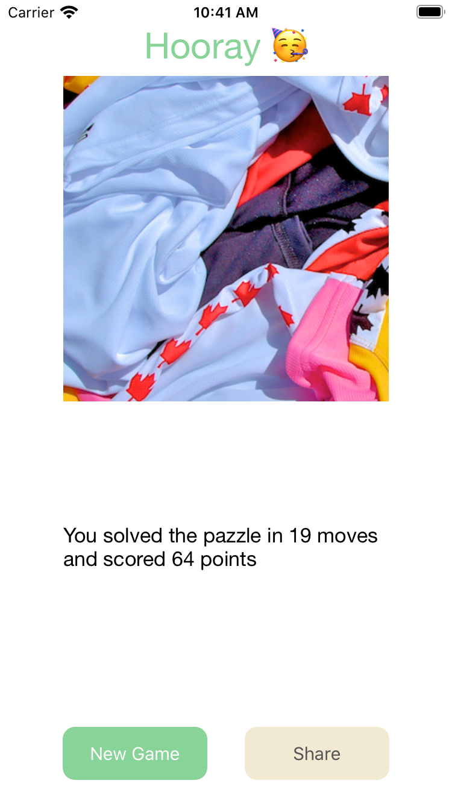

## Landscape

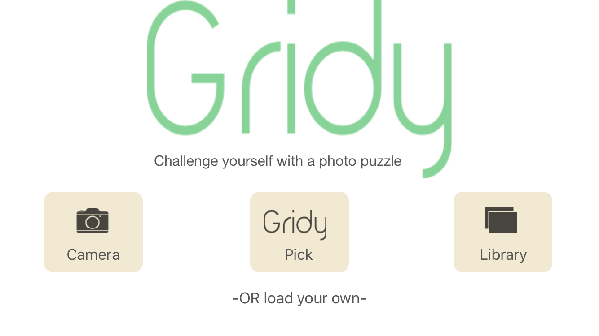

  

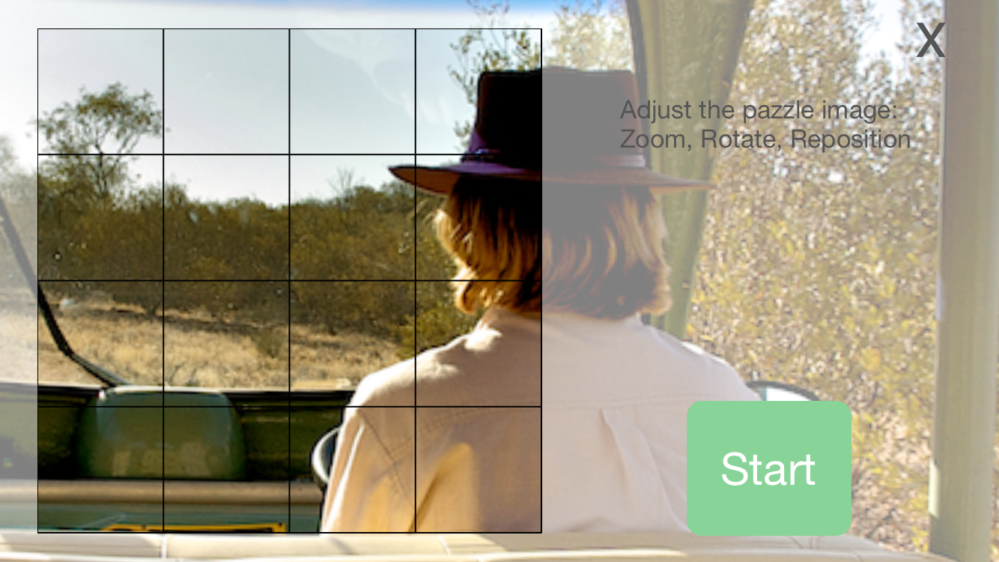

  

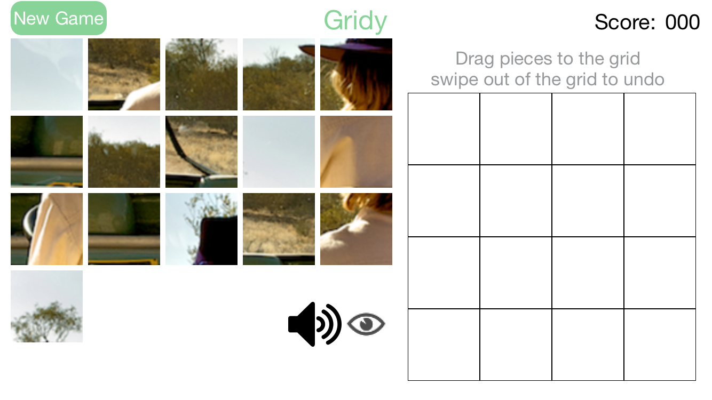

  

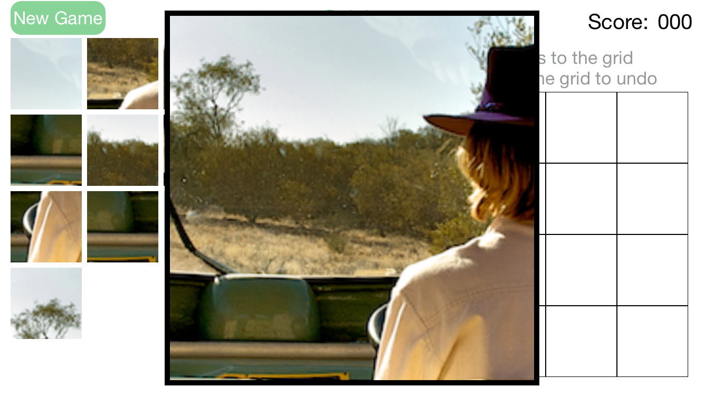

  

  

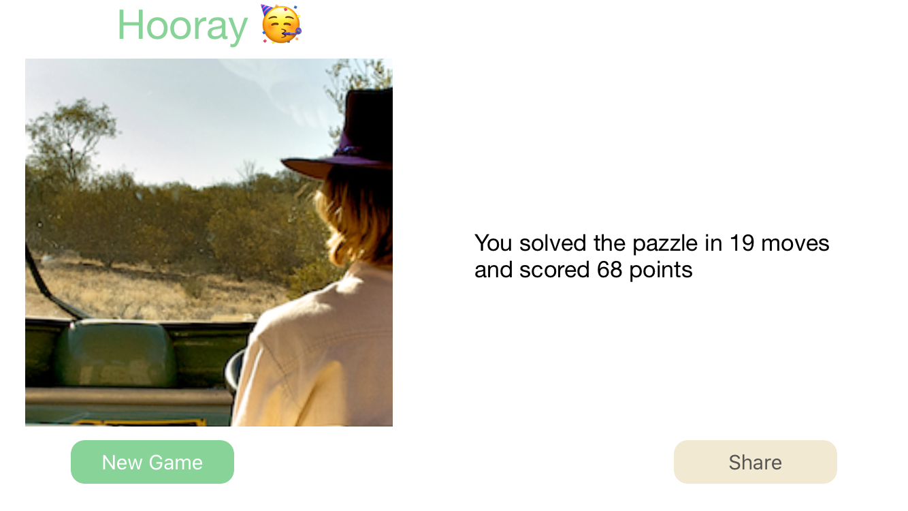

  

